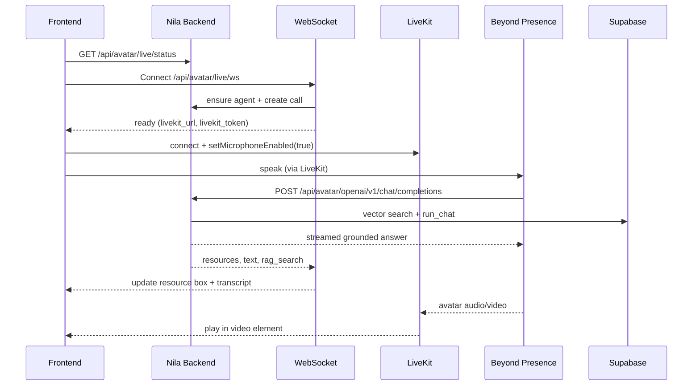

# Frontend integration: Beyond Presence avatar live + resource box

Complete API guide for building a client that talks to **Nila’s live video avatar** (Beyond Presence + LiveKit) with a **resources panel** (forms, offices, laws from Supabase).

The backend owns Bey, Supabase, OpenAI/Gemini, and ElevenLabs keys. The frontend only needs:

1. **HTTP** — readiness, optional setup  
2. **WebSocket** — session events + **resource box** + transcript  
3. **LiveKit** — microphone in, avatar video/audio out  

---

## Table of contents

1. [Architecture](#architecture)
2. [Base URLs](#base-urls)
3. [Prerequisites](#prerequisites)
4. [Integration checklist](#integration-checklist)
5. [REST: readiness](#rest-readiness)
6. [REST: setup & helpers](#rest-setup--helpers)
7. [WebSocket: main session](#websocket-main-session)
8. [Resource box contract](#resource-box-contract)
9. [LiveKit (browser)](#livekit-browser)
10. [End-to-end sequence](#end-to-end-sequence)
11. [TypeScript types](#typescript-types)
12. [Minimal React flow](#minimal-react-flow)
13. [Local vs voice-RAG modes](#local-vs-voice-rag-modes)
14. [Do not call from the browser](#do-not-call-from-the-browser)
15. [Troubleshooting](#troubleshooting)

---

## Architecture



**Two connections from the browser:**

| Connection | Purpose |
|------------|---------|
| `WebSocket` `/api/avatar/live/ws` | Control plane: status, **resources**, transcript, errors |
| `LiveKit` (`livekit_url` + `livekit_token`) | Media plane: mic upload, avatar A/V |

**Do not** send microphone PCM on the WebSocket (unlike `/api/live/eleven/ws`).

---

## Base URLs

| Environment | HTTP | WebSocket |
|-------------|------|-----------|
| Local | `http://localhost:8000` | `ws://localhost:8000` |
| Public tunnel / deploy | `https://your-api.example.com` | `wss://your-api.example.com` |

```ts
const API = import.meta.env.VITE_NILA_API_URL ?? "http://localhost:8000";

export const avatarLiveWs = () => {
  const ws = API.replace(/^http/, "ws");
  return `${ws}/api/avatar/live/ws`;
};
```

**CORS:** enabled for all origins in development (`*`).

**Auth:** no browser auth headers required today on WebSocket or public avatar routes.

---

## Prerequisites

Backend operator must configure (not in frontend):

| Item | Why |
|------|-----|
| `BEYOND_PRESENCE_API_KEY` | Create agents & calls |
| `BEY_AGENT_ID` (or run setup) | Valid agent UUID |
| `OPENAI_API_KEY`, `SUPABASE_*` | RAG |
| `NILA_PUBLIC_BASE_URL` | **Required** for spoken Supabase answers (Bey calls your API) |

Check before enabling **Connect**:

```http
GET /api/avatar/live/status
```

Enable Connect when `ready === true`.

---

## Integration checklist

- [ ] `GET /api/avatar/live/status` on load  
- [ ] **Connect** button (user gesture — required for microphone)  
- [ ] Open `WebSocket` → handle `ready`  
- [ ] `livekit-client`: connect, publish mic, attach remote tracks to `<video>`  
- [ ] On `resources` → render resource box (replace list each message)  
- [ ] On `text` → transcript (optional)  
- [ ] On `status` / `error` → status line  
- [ ] On disconnect → close WS + `room.disconnect()`  
- [ ] Do **not** call `/api/avatar/openai/v1/chat/completions` from the browser  

---

## REST: readiness

### `GET /api/avatar/live/status`

Call before showing **Connect**.

**Response `200`:**

```json
{
  "beyond_presence_key": true,
  "supabase_ok": true,
  "vector_docs": 8,
  "supabase_message": "",
  "public_base_url": "https://xxxx.trycloudflare.com",
  "rag_llm_ready": true,
  "local_mode": false,
  "openai_llm_url": "https://xxxx.trycloudflare.com/api/avatar/openai/v1",
  "rag_backend": "supabase",
  "ready": true,
  "voice_uses_supabase_rag": true,
  "resources_from_speech": "external_llm",
  "checks": {
    "beyond_presence": true,
    "supabase": true,
    "public_url": true
  },
  "message": "Ready — live avatar with Supabase answers in speech."
}
```

**Fields to use in UI:**

| Field | Use |
|-------|-----|
| `ready` | Enable/disable Connect |
| `message` | Banner text |
| `voice_uses_supabase_rag` | Badge: “Voice uses government knowledge base” |
| `local_mode` | `true` = avatar voice is Bey default; resources still work via polling |
| `supabase_ok` | Warn if knowledge base empty |

---

### `GET /api/avatar/live/rag-test`

Smoke test without WebSocket (dev/debug).

```http
GET /api/avatar/live/rag-test?query=birth+registration+Sri+Lanka
```

**Response `200`:**

```json
{
  "ok": true,
  "query": "birth registration Sri Lanka",
  "answer": "To register a birth in Sri Lanka...",
  "engine": "openai",
  "resource_count": 3,
  "resources": [
    {
      "type": "form",
      "name": "BDR-1 Birth Registration Form",
      "url": "https://www.registrar-general.gov.lk/forms",
      "label": "Download Form"
    }
  ],
  "supabase": true
}
```

---

## REST: setup & helpers

### `POST /api/avatar/setup`

Creates or fixes Bey agent and registers external LLM (when `NILA_PUBLIC_BASE_URL` is set). Ops/first-run — not required on every page load if backend is already configured.

**Request (optional body):**

```json
{
  "public_base_url": "https://xxxx.trycloudflare.com"
}
```

**Response `200`:**

```json
{
  "ok": true,
  "agent_id": "46358f01-0997-4ad9-b968-ce70ab594ff4",
  "embed_url": "https://bey.chat/46358f01-0997-4ad9-b968-ce70ab594ff4",
  "rag_enabled": true,
  "openai_llm_url": "https://xxxx.trycloudflare.com/api/avatar/openai/v1",
  "message": "Agent ready — use POST /api/avatar/live/ws or Connect on /avatar."
}
```

---

### `POST /api/avatar/live/session`

REST-only alternative to WebSocket `ready` (LiveKit creds without WS resource push). Prefer WebSocket for full UX.

**Request (optional):**

```json
{ "public_base_url": "https://xxxx.trycloudflare.com" }
```

**Response `200`:**

```json
{
  "ok": true,
  "session_id": "uuid",
  "agent_id": "...",
  "livekit_url": "wss://....livekit.cloud",
  "livekit_token": "eyJ...",
  "call_id": "...",
  "rag_enabled": true
}
```

---

### Other `/api/avatar/*` (optional)

| Method | Path | Use |
|--------|------|-----|
| `POST` | `/api/avatar/ask` | One-shot RAG + TTS (not live duplex) |
| `POST` | `/api/avatar/livekit-session` | LiveKit only, no WS |
| `GET` | `/api/avatar/agents` | List Bey agents |
| `GET` | `/api/avatar/embed` | iframe URL `https://bey.chat/{id}` |
| `GET` | `/api/avatar/status` | Legacy config checklist |

---

## WebSocket: main session

### Endpoint

```text
ws(s)://{HOST}/api/avatar/live/ws
```

- No query params required today.  
- Connect **after** user clicks Connect (mic permission).  
- One WS per user session; server creates one Bey call per connection.

---

### Client → server

| `type` | Body | When |
|--------|------|------|
| `ping` | `{}` | Keepalive (optional) |
| `text` | `{ "text": "How do I register a birth?" }` | Typed question → force RAG + resources |
| `user_transcript` | `{ "text": "..." }` | Same as `text` (alias) |

**Example:**

```json
{ "type": "text", "text": "How do I register a birth in Sri Lanka?" }
```

---

### Server → client

| `type` | Key fields | UI action |
|--------|------------|-----------|
| `ready` | `livekit_url`, `livekit_token`, `session_id`, `agent_id`, `voice_uses_supabase_rag`, `local_mode`, `embed_url` | Start LiveKit |
| `status` | `message` | Status / toast |
| `resources` | `resources[]` | **Update resource box** (full list) |
| `rag_search` | `query`, `resource_count`, `supabase`, `engine?` | “Loaded from knowledge base” |
| `rag_applied` | `query`, `resource_count`, `engine`, `supabase` | Same; fired after answer text |
| `text` | `role`: `"user"` \| `"model"`, `text` | Transcript panel |
| `error` | `message` | Error state |
| `pong` | — | Reply to `ping` |

---

### `ready` (detail)

```json
{
  "type": "ready",
  "session_id": "550e8400-e29b-41d4-a716-446655440000",
  "agent_id": "46358f01-0997-4ad9-b968-ce70ab594ff4",
  "livekit_url": "wss://prod-xxxx.livekit.cloud",
  "livekit_token": "eyJhbGciOiJIUzI1NiIs...",
  "call_id": "FhRFYKQtX3zjHgGOsrtg",
  "rag_enabled": true,
  "local_mode": false,
  "voice_uses_supabase_rag": true,
  "resources_from_speech": "external_llm",
  "embed_url": "https://bey.chat/46358f01-0997-4ad9-b968-ce70ab594ff4",
  "openai_llm_url": "https://your-api.example.com/api/avatar/openai/v1"
}
```

| Field | Description |
|-------|-------------|
| `livekit_url` | Pass to `room.connect()` |
| `livekit_token` | Pass to `room.connect()` |
| `voice_uses_supabase_rag` | `true` → avatar speech is Supabase-grounded |
| `local_mode` | `true` → no public URL; resources via transcript polling |
| `resources_from_speech` | `"external_llm"` or `"call_transcript_poll"` |

---

### Typical message order (voice RAG mode)

1. `status` — “Configuring…”  
2. `ready` — LiveKit creds  
3. `status` — “Connected…”  
4. User speaks (government question)  
5. `text` `role: user` — transcript (from Bey → backend)  
6. `status` — “Loading answer from Supabase…”  
7. `resources` — **resource box updates**  
8. `rag_search` — metadata  
9. `text` `role: model` — official answer text  
10. `rag_applied` — confirmation  
11. `status` — “Answer ready from government knowledge base.”  
12. User hears avatar speak (via LiveKit, driven by Bey + RAG)

---

## Resource box contract

### `resources` message

```json
{
  "type": "resources",
  "resources": [
    {
      "type": "form",
      "name": "BDR-1 Birth Registration Form",
      "url": "https://www.registrar-general.gov.lk/forms",
      "label": "Download Form"
    },
    {
      "type": "office",
      "name": "Divisional Secretariat (nearest)",
      "url": "https://www.dsboffice.gov.lk",
      "label": "Visit Office"
    },
    {
      "type": "law",
      "name": "Births and Deaths Registration Act No. 17 of 1951",
      "url": "https://www.registrar-general.gov.lk",
      "label": "View Law"
    }
  ]
}
```

### Resource object

| Field | Type | Required | Description |
|-------|------|----------|-------------|
| `type` | string | yes | `"form"` \| `"office"` \| `"law"` |
| `name` | string | yes | Display title |
| `url` | string \| null | no | Link (open in new tab) |
| `label` | string | yes | Button/link text: `Download Form`, `Visit Office`, `View Law` |

### UI rules

1. **Replace** the panel contents on each `resources` message (server sends full list, not deltas).  
2. Group or icon by `type` if you want.  
3. Use `label` for CTA text, `name` as subtitle.  
4. Hide panel or show empty state before first `resources`.  
5. Optional: show loading when you receive `status` containing `Loading answer from Supabase`.

### Same shape as text chat

Identical to `resources` from `POST /api/chat` — you can reuse the same React component.

---

## LiveKit (browser)

Install:

```bash
npm install livekit-client
```

After WebSocket `ready`:

```ts
import { Room, RoomEvent } from "livekit-client";

export async function connectAvatar(
  videoEl: HTMLVideoElement,
  livekitUrl: string,
  livekitToken: string
) {
  const room = new Room({
    audioCaptureDefaults: {
      echoCancellation: true,
      noiseSuppression: true,
    },
  });

  room.on(RoomEvent.TrackSubscribed, (track) => {
    if (track.kind === "video" || track.kind === "audio") {
      track.attach(videoEl);
      videoEl.muted = false;
    }
  });

  await room.connect(livekitUrl, livekitToken);

  const micOn = await room.localParticipant.setMicrophoneEnabled(true);
  if (!micOn) {
    throw new Error("Microphone could not be enabled");
  }

  try {
    await room.startAudio();
  } catch {
    /* browser autoplay policy */
  }

  return room;
}
```

**Disconnect:**

```ts
await room.disconnect();
videoEl.srcObject = null;
```

Reference implementation: `static/js/livekit-bey.js`, `static/avatar-beyond.html`.

---

## End-to-end sequence

```
1. Page load
   → GET /api/avatar/live/status
   → if !ready: show message, disable Connect

2. User clicks "Connect"
   → new WebSocket(avatarLiveWs())
   → onmessage: handle JSON by type

3. On type === "ready"
   → connectAvatar(video, livekit_url, livekit_token)
   → show "Live" badge

4. User speaks (government topic)
   → Backend runs RAG (via Bey external LLM OR transcript poll)
   → WS: resources, text, rag_search, rag_applied, status
   → Update resource box + transcript
   → Hear avatar on video element

5. Optional: user types question
   → ws.send({ type: "text", text: "..." })

6. User clicks Disconnect
   → room.disconnect()
   → ws.close()
   → clear resource box / transcript
```

---

## TypeScript types

```ts
export type ResourceType = "form" | "office" | "law";

export interface Resource {
  type: ResourceType;
  name: string;
  url?: string | null;
  label: string;
}

export interface AvatarLiveStatus {
  ready: boolean;
  message: string;
  voice_uses_supabase_rag: boolean;
  local_mode: boolean;
  supabase_ok: boolean;
  public_base_url: string | null;
}

export type ServerMessage =
  | {
      type: "ready";
      session_id: string;
      agent_id: string;
      livekit_url: string;
      livekit_token: string;
      call_id: string;
      voice_uses_supabase_rag: boolean;
      local_mode: boolean;
      rag_enabled?: boolean;
      embed_url?: string;
    }
  | { type: "status"; message: string }
  | { type: "resources"; resources: Resource[] }
  | {
      type: "rag_search" | "rag_applied";
      query: string;
      resource_count: number;
      supabase: boolean;
      engine?: string;
    }
  | { type: "text"; role: "user" | "model"; text: string }
  | { type: "error"; message: string }
  | { type: "pong" };

export type ClientMessage =
  | { type: "ping" }
  | { type: "text"; text: string }
  | { type: "user_transcript"; text: string };
```

---

## Minimal React flow

```tsx
const [status, setStatus] = useState<AvatarLiveStatus | null>(null);
const [resources, setResources] = useState<Resource[]>([]);
const [transcript, setTranscript] = useState("");
const [liveStatus, setLiveStatus] = useState("");
const wsRef = useRef<WebSocket | null>(null);
const roomRef = useRef<Room | null>(null);
const videoRef = useRef<HTMLVideoElement>(null);

useEffect(() => {
  fetch(`${API}/api/avatar/live/status`)
    .then((r) => r.json())
    .then(setStatus);
}, []);

function onWsMessage(msg: ServerMessage) {
  switch (msg.type) {
    case "ready":
      connectAvatar(videoRef.current!, msg.livekit_url, msg.livekit_token).then(
        (room) => {
          roomRef.current = room;
          setLiveStatus("Live");
        }
      );
      break;
    case "resources":
      setResources(msg.resources);
      break;
    case "text":
      setTranscript(msg.text);
      break;
    case "status":
      setLiveStatus(msg.message);
      break;
    case "error":
      setLiveStatus(msg.message);
      break;
  }
}

async function connect() {
  const ws = new WebSocket(avatarLiveWs());
  wsRef.current = ws;
  ws.onmessage = (ev) => onWsMessage(JSON.parse(ev.data));
}

async function disconnect() {
  await roomRef.current?.disconnect();
  wsRef.current?.close();
  setResources([]);
  setLiveStatus("");
}
```

---

## Local vs voice-RAG modes

| | `local_mode: true` | `voice_uses_supabase_rag: true` |
|--|---------------------|----------------------------------|
| `NILA_PUBLIC_BASE_URL` | Not set | Set (tunnel/deploy) |
| Avatar speech | Bey default LLM | **Supabase RAG** |
| Resource box | Transcript polling + `text` WS | Each spoken turn + `text` WS |
| Friend on internet | Needs tunnel for Bey RAG voice | Same public URL |

For **friends on the internet**, deploy or share a stable `https` API URL and set `NILA_PUBLIC_BASE_URL` to that same URL.

---

## Do not call from the browser

| Endpoint | Reason |
|----------|--------|
| `POST /api/avatar/openai/v1/chat/completions` | Called by **Beyond Presence servers** with `Authorization: Bearer {BEY_LLM_API_SECRET}` |

---

## Troubleshooting

| Symptom | Fix |
|---------|-----|
| `ready: false` | Backend keys; run `POST /api/avatar/setup` |
| No mic prompt | Connect on button click; `setMicrophoneEnabled(true)` |
| Empty resource box | Ask government question; check `rag-test`; listen for `resources` WS |
| Avatar talks, generic answers | Set `NILA_PUBLIC_BASE_URL`, rerun setup; check `voice_uses_supabase_rag` |
| WS works locally, friend fails | Friend must use **public** `https` URL, not `localhost` |
| LiveKit connects, no video | `TrackSubscribed` → `track.attach(video)`; `playsInline` on iOS |
| CORS errors | Point to correct API host; backend allows `*` in dev |

---

## Reference UIs in this repo

| File | Description |
|------|-------------|
| [static/avatar-beyond.html](../static/avatar-beyond.html) | Full reference page at `/avatar` |
| [static/js/livekit-bey.js](../static/js/livekit-bey.js) | LiveKit + mic helpers |
| [frontend/nila-avatar/src/App.jsx](../frontend/nila-avatar/src/App.jsx) | React reference |

---

## Related docs

- [README](../README.md) — setup, tunnel scripts, env vars  
- [FRONTEND_LIVE_ELEVEN.md](./FRONTEND_LIVE_ELEVEN.md) — voice-only live (no avatar)  
- [Beyond Presence LiveKit docs](https://docs.bey.dev/integrations/managed-agents/livekit-client-sdk)  
- [livekit-client](https://github.com/livekit/client-sdk-js)
