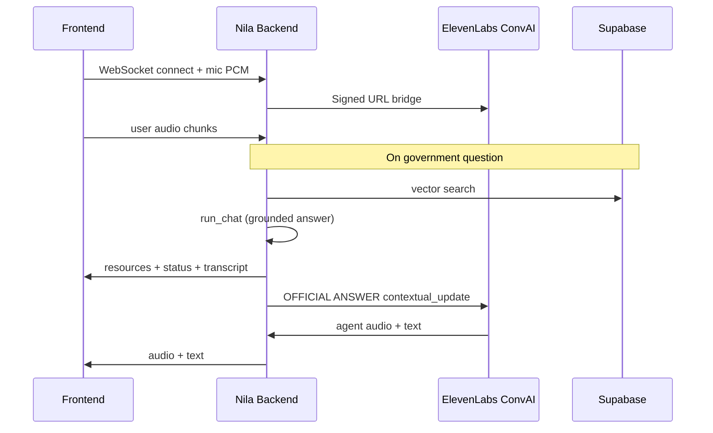

# Frontend integration: ElevenLabs live voice (`/live-eleven`)

This guide is for frontend developers integrating **Nila English live speech** (ElevenLabs voice + Supabase knowledge base) into a web or mobile app.

The backend owns ElevenLabs, OpenAI embeddings, and Supabase. The frontend only needs a **WebSocket client**, **microphone capture**, and **audio playback**.

---

## Architecture



**Do not** call ElevenLabs or Supabase from the browser. API keys stay in backend `.env` only.

---

## Base URLs

| Environment | HTTP API | WebSocket |
|-------------|----------|-----------|
| Local | `http://localhost:8000` | `ws://localhost:8000` |
| Production | `https://your-api.example.com` | `wss://your-api.example.com` |

CORS is enabled for all origins (`allow_origins: *` in `main.py`).

Suggested frontend env:

```env
VITE_NILA_API_URL=http://localhost:8000
```

```ts
export const nilaApi = import.meta.env.VITE_NILA_API_URL;
export const nilaLiveElevenWs = () =>
  `${nilaApi.replace(/^http/, "ws")}/api/live/eleven/ws`;
```

---

## Integration options

### Option A — Reference UI (fastest)

- **Page:** `GET /live-eleven` → `static/live-eleven.html`
- **Source to copy:** [`static/live-eleven.html`](../static/live-eleven.html)

Use for prototyping, iframe embed, or porting logic into your component library.

### Option B — Custom UI (production)

Implement the WebSocket protocol below in React, Vue, Next.js, etc.

---

## REST endpoints (before Connect)

### Readiness

```http
GET /api/live/eleven/status
```

Example response:

```json
{
  "convai_ok": true,
  "supabase_ok": true,
  "vector_docs": 2,
  "rag_tool": "search_government_knowledge",
  "rag_backend": "supabase",
  "agent_id": "agent_...",
  "tts_ok": true,
  "message": "ConvAI ready."
}
```

Enable **Connect** only when `convai_ok` and `supabase_ok` are `true`.

### RAG smoke test (no WebSocket)

```http
GET /api/live/eleven/rag-test?query=birth+certificate+Sri+Lanka
```

Example response:

```json
{
  "ok": true,
  "query": "birth certificate Sri Lanka",
  "answer": "To register a birth in Sri Lanka...",
  "engine": "openai",
  "resource_count": 3,
  "resources": [
    {
      "type": "form",
      "name": "BDR-1 Birth Registration Form",
      "url": "https://www.registrar-general.gov.lk/forms",
      "label": "Download Form"
    }
  ]
}
```

### Agent ID (debug)

```http
GET /api/live/eleven/agent-id
```

---

## WebSocket (main integration)

### Endpoint

```text
ws(s)://{API_HOST}/api/live/eleven/ws
```

No auth headers are required today.

### Client → server

| `type` | Body | Notes |
|--------|------|--------|
| `audio` | `{ "type": "audio", "data": "<base64>" }` | Mic PCM: **16 kHz**, mono, **16-bit little-endian** |
| `text` | `{ "type": "text", "text": "..." }` | Optional typed user message |

**Microphone:** Use `navigator.mediaDevices.getUserMedia({ audio: true })`, `AudioContext({ sampleRate: 16000 })`, convert float samples to Int16, base64-encode the buffer.

**Echo reduction:** Do not send mic chunks while the agent is playing audio (`agentSpeaking === true` in the reference UI).

### Server → client

| `type` | Fields | UI usage |
|--------|--------|----------|
| `status` | `message`; optional `audio_sample_rate`, `audio_encoding` | Status line, toasts |
| `text` | `role`: `"user"` \| `"model"`, `text` | Transcript |
| `resources` | `resources`: `Resource[]` | Forms / offices / laws panel |
| `rag_search` | `query`, `resource_count`, `supabase`, optional `engine` | “Loaded from knowledge base” hint |
| `audio` | `data` (base64), `encoding` (`"pcm"`), `sample_rate` (e.g. `16000`) | Play agent voice |
| `error` | `message` | Error state |

### TypeScript types

```ts
type Resource = {
  type: "form" | "office" | "law";
  name: string;
  url?: string | null;
  label: string; // e.g. "Download Form", "Visit Office", "View Law"
};

type ServerMessage =
  | { type: "status"; message: string; audio_sample_rate?: number; audio_encoding?: string }
  | { type: "text"; role: "user" | "model"; text: string }
  | { type: "resources"; resources: Resource[] }
  | { type: "rag_search"; query: string; resource_count: number; supabase: boolean; engine?: string }
  | { type: "audio"; data: string; encoding: string; sample_rate: number }
  | { type: "error"; message: string };

type ClientMessage =
  | { type: "audio"; data: string }
  | { type: "text"; text: string };
```

---

## Audio playback (agent voice)

1. Wait for a `status` message that includes `audio_sample_rate` and `audio_encoding` (often `pcm` @ `16000`).
2. For each `audio` message, decode base64 → Int16 PCM.
3. Batch small chunks (~100–120 ms) into WAV blobs and play with `<audio playsinline>` (Safari-friendly), or schedule buffers in Web Audio at the correct sample rate.

Reference: `enqueuePcm`, `buildWavBlob`, `drainWavQueue` in [`static/live-eleven.html`](../static/live-eleven.html).

---

## How Supabase answers reach the user

1. User speech is transcribed by ElevenLabs; backend receives `user_transcript` events (forwarded as `text` / `role: user`).
2. For government-related phrases, backend runs **`run_chat`** (same as `POST /api/chat`): Supabase vector search → grounded English answer.
3. Backend sends **`resources`** to the UI and an **`OFFICIAL ANSWER`** `contextual_update` to ElevenLabs so the **spoken** reply follows knowledge-base data.
4. Agent audio arrives as `audio` messages; transcript as `text` / `role: model`.

Expect ~2–4 seconds after a government question before resources and the grounded answer are ready. Status text: `Loading answer from Supabase…` then `Answer ready from government knowledge base.`

---

## Minimal client example

```ts
const API = import.meta.env.VITE_NILA_API_URL ?? "http://localhost:8000";

export async function connectNilaLiveEleven(handlers: {
  onStatus: (message: string) => void;
  onText: (role: "user" | "model", text: string) => void;
  onResources: (resources: Resource[]) => void;
  onAudio: (data: string, sampleRate: number) => void;
  onError: (message: string) => void;
}) {
  const ws = new WebSocket(`${API.replace(/^http/, "ws")}/api/live/eleven/ws`);

  ws.onmessage = (ev) => {
    const msg = JSON.parse(ev.data) as ServerMessage;
    switch (msg.type) {
      case "status":
        handlers.onStatus(msg.message);
        break;
      case "text":
        handlers.onText(msg.role, msg.text);
        break;
      case "resources":
        handlers.onResources(msg.resources);
        break;
      case "audio":
        handlers.onAudio(msg.data, msg.sample_rate);
        break;
      case "error":
        handlers.onError(msg.message);
        break;
      case "rag_search":
        handlers.onStatus(
          `Knowledge base: ${msg.resource_count} resource(s) for “${msg.query}”`
        );
        break;
    }
  };

  return {
    ws,
    sendPcm: (base64Pcm: string) => {
      if (ws.readyState === WebSocket.OPEN) {
        ws.send(JSON.stringify({ type: "audio", data: base64Pcm }));
      }
    },
    disconnect: () => ws.close(),
  };
}
```

Wire `sendPcm` from your mic pipeline (see reference HTML).

---

## Related APIs (non-live)

| Feature | Method | Path |
|---------|--------|------|
| Text chat + resources | `POST` | `/api/chat` |
| Record → transcribe → reply + TTS | `POST` | `/api/voice` |
| Avatar WebRTC stream | `POST` | `/api/avatar` |
| OpenAI Realtime English (no ElevenLabs) | WebSocket | `/api/live/en/ws` |
| Sinhala Gemini live | WebSocket | `/api/live/ws` |
| Global stats | `GET` | `/api/status` |

### `POST /api/chat`

Request:

```json
{
  "message": "How do I get a birth certificate?",
  "language": "en",
  "history": [],
  "session_id": null
}
```

Response:

```json
{
  "reply": "...",
  "engine": "openai",
  "language": "en",
  "resources": [/* same Resource shape */],
  "session_id": "uuid"
}
```

---

## UX checklist

- [ ] Call `GET /api/live/eleven/status` before enabling Connect
- [ ] Request mic permission on user gesture (Connect button)
- [ ] Use **HTTPS** + **`wss://`** in production
- [ ] Recommend **headphones** in the UI
- [ ] Render **resources** panel from `type: "resources"`
- [ ] Show transcript from `type: "text"`
- [ ] Play `type: "audio"` with correct PCM sample rate
- [ ] Mute mic uplink while agent audio is playing

---

## Backend-only configuration

These are **not** used by the frontend:

| Variable | Purpose |
|----------|---------|
| `ELEVENLABS_API_KEY` | ConvAI + TTS |
| `ELEVENLABS_AGENT_ID` | Dashboard agent |
| `VOICE_ID_EN` | English voice |
| `OPENAI_API_KEY` | Embeddings + grounded answers |
| `SUPABASE_URL` / `SUPABASE_SERVICE_KEY` | Vector DB |
| `ELEVENLABS_SEND_INIT` | Default `true` — RAG prompt on connect |

---

## Troubleshooting

| Symptom | Check |
|---------|--------|
| Connect fails immediately | `GET /api/live/eleven/status` → `convai_ok`, `agent_id` |
| Voice works, no resources | Ask a **Sri Lanka government** question; watch for `rag_search` / `resources` messages |
| No voice | Browser console; confirm `audio` messages; use reference WAV playback |
| `vector_docs: 0` | Run `python seed_content.py` and Supabase `match_documents` SQL |
| CORS errors | API URL must match backend; CORS is `*` on this service |

---

## Reference files

| File | Role |
|------|------|
| [`static/live-eleven.html`](../static/live-eleven.html) | Full working UI |
| [`routers/live_elevenlabs.py`](../routers/live_elevenlabs.py) | WebSocket bridge |
| [`lib/chat_service.py`](../lib/chat_service.py) | Grounded answers (`run_chat`) |
| [`lib/rag_tools.py`](../lib/rag_tools.py) | Supabase search helpers |

OpenAPI / interactive docs when the server is running: [http://localhost:8000/docs](http://localhost:8000/docs)
